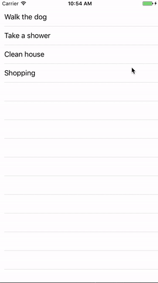

# MJSnackBar		

 [](http://cocoapods.org/pods/MJSnackBar)
 [](https://github.com/Carthage/Carthage)
 [](http://cocoapods.org/pods/MJSnackBar)

 [](http://cocoapods.org/pods/MJSnackBar)
 []()
 [](https://img.shields.io/cocoapods/metrics/doc-percent/MJSnackBar.svg)

 MJSnackBar is a pure Swift implementation of the [Android SnackBar](https://material.io/guidelines/components/snackbars-toasts.html) which is very useful to display short informations and allow user to perform an action about it. It automatically disappear after a delay that you can set.

 		

## Installation							

#### CocoaPods :							
 MJSnackBar is available through [CocoaPods](http://cocoapods.org). To install		
 it, simply add the following line to your Podfile:		     	

 ```ruby
  pod "MJSnackBar"		
 ``` 				

#### Carthage :		

You can use Carthage to include MJSnackBar into your project. Just add this dependency to your Cartfile:
```
  github "Shakarang/MJSnackBar"
```

## Example Project		

 The included example project provides a demonstration of MJSnackBar. It's a UITableView with a little ToDo list. When you delete an item, the MJSnackBar is presented with a button allowing user to undo that action.

### Usage :		

##### Preconfigured way :		

When instantiating the MJSnackBar, you have to pass, as a parameter, the view it will be shown on.

 ```swift	       	   
 let snackBar = MJSnackBar(onView: self.view)
 ``` 	 

#### Configuration :

It is a UIView subclass, so you are free to change the same properties like the ```backgroundColor```, etc..

However, there are some MJSnackBar properties that you can modify.
```Swift
    /// Animation duration
    public var animationDuration: Double = 0.4

    /// How long the SnackBar will be shown
    public var timeSnackBarShown: Double = 2.0

    /// SnackBar height
    public var snackBarDefaultHeight: CGFloat = 48.0

    /// Allow the SnackBar height to automatically adjust
    /// its height based on the content
    public var allowHeightChange: Bool = true

    /// SnackBar margins
    public var spaceBetweenElements: CGFloat = 24.0

    /// SnackBar side margins to view
    public var sideMargins: CGFloat = 0.0

    /// SnackBar bottom margin to view
    public var bottomMargin: CGFloat = 0.0

    /// SnackBar internal content margin
    public var elementsTopBottomMargins: CGFloat = 14.0

    /// Font of displayed message
    public var messageFont: UIFont? = nil

    /// Font of action button
    public var actionFont: UIFont? = UIFont.boldSystemFont(ofSize: UIFont.labelFontSize)

    /// Message text color
    public var messageColor: UIColor = .white

    /// Action text color
    public var actionColorColor: UIColor = .red
```

#### Data :

To show the MJSnackBar, you have to create a ```MJSnackBarData``` instance and call a specific method :

```swift
  let data = MJSnackBarData(withIdentifier: indexPath.row, message: msg, andActionMessage: "UNDO", objectSaved: dataArray[indexPath.row])

  snackbar.show(data: data, onView: self.view)
```

When showing the information to the user, you will often do an action behind it.
To help you handle the different events, the ```MJSnackBarData``` comes with multiple fields :

- **identifier** (Optional) : Int, help you identify the data.
- **message** : String, the message that will be displayed.
- **actionMessage** (Optional) : String, the action message that will be displayed.
- **objectSaved** (Optional) : Any, the object concerned by the data. You can retrieve it by casting it.

#### Handle events :

To be able to handle the different events, you have to implement 3 methods which come with the ```MJSnackBarDelegate```.
They let you know when a MJSnackBar is displayed, hidden, or if a user performed an action on it.

To tell the bar that your class can handle its events :
```swift
  snackbar.delegate = self
```

```swift

extension ViewController: MJSnackBarDelegate {

    func snackBarDisappeared(with data: MJSnackBarData, reason: MJSnackBar.EndShowingType) {
        print("👻 SnackBar disappeared \(data.message) - Reason : \(reason)")
    }

    func snackBarAppeared(with data: MJSnackBarData) {
        print("⭐ SnackBar appeared \(data.message)")
    }

    func snackBarActionTriggered(with data: MJSnackBarData) {

        print("👆 SnackBar touched \(data.message)")

        if let id = data.id {

            let indexPath = IndexPath(row: id, section: 0)

            if let originalData = data.originalObject as? String {
                self.dataArray.insert(originalData, at: id)
            }

            self.examplTableView.insertRows(at: [indexPath], with: .automatic)
        }
    }
}
```

## Contribution :

Feel free to fork the project or to give it a ⭐
